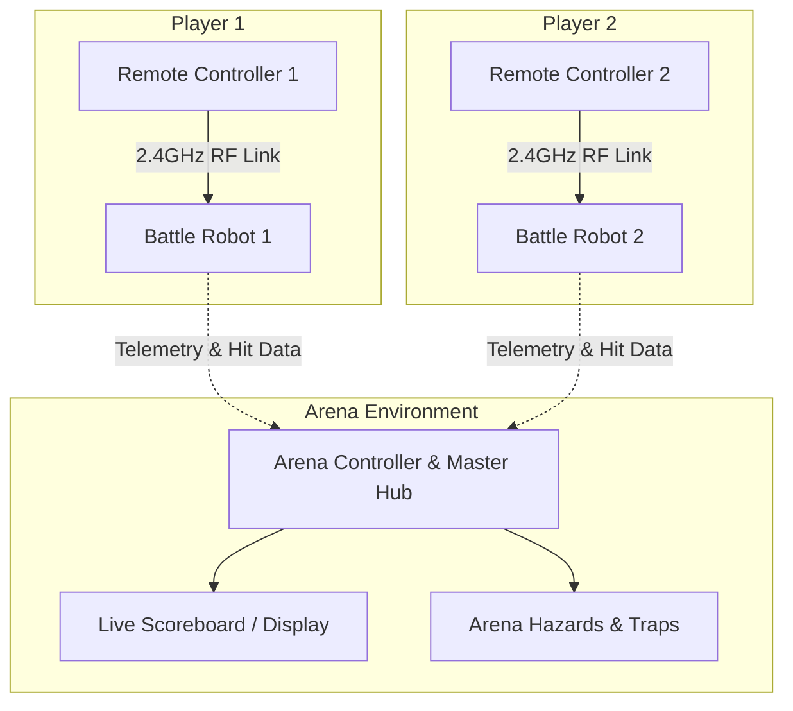

# BattleBit

**BattleBit** is an interactive, microcontroller-based dual combat robot arena platform. It features custom handheld wireless controllers, responsive combat robots with weapon systems and impact sensors, and a central arena controller that manages timers, hazards, and real-time match scoring.

---

## System Architecture



---

## Repository Structure

Click into any folder to view its dedicated documentation and specifications:

| Directory | Description | Documentation |
| :--- | :--- | :--- |
| **`diagrams/`** | System architecture diagrams, circuit schematics, wiring pinouts, and flowcharts. | [diagrams/README.md](file:///Volumes/Academic/Project/Microcontroller%20base%20project/BattleBit/Code/diagrams/README.md) |
| **`docs/`** | Technical specifications, RF communication protocols, game rules, and assembly guides. | [docs/README.md](file:///Volumes/Academic/Project/Microcontroller%20base%20project/BattleBit/Code/docs/README.md) |
| **`firmware/`** | Embedded C/C++ source code for robots, remotes, and the arena controller. | [firmware/README.md](file:///Volumes/Academic/Project/Microcontroller%20base%20project/BattleBit/Code/firmware/README.md) |
| ├── `firmware/arena/` | Match timer, scoring, hazard actuation, and scoreboard firmware. | [firmware/arena/README.md](file:///Volumes/Academic/Project/Microcontroller%20base%20project/BattleBit/Code/firmware/arena/README.md) |
| ├── `firmware/remote-1/` | Player 1 handheld controller firmware (joysticks, triggers, RF). | [firmware/remote-1/README.md](file:///Volumes/Academic/Project/Microcontroller%20base%20project/BattleBit/Code/firmware/remote-1/README.md) |
| ├── `firmware/remote-2/` | Player 2 handheld controller firmware (joysticks, triggers, RF). | [firmware/remote-2/README.md](file:///Volumes/Academic/Project/Microcontroller%20base%20project/BattleBit/Code/firmware/remote-2/README.md) |
| ├── `firmware/robot-1/` | Battle Robot 1 firmware (drive motors, weapon control, hit sensing). | [firmware/robot-1/README.md](file:///Volumes/Academic/Project/Microcontroller%20base%20project/BattleBit/Code/firmware/robot-1/README.md) |
| └── `firmware/robot-2/` | Battle Robot 2 firmware (drive motors, weapon control, hit sensing). | [firmware/robot-2/README.md](file:///Volumes/Academic/Project/Microcontroller%20base%20project/BattleBit/Code/firmware/robot-2/README.md) |
| **`hardware/`** | PCB schematics/layouts, 3D printable CAD models (chassis, weapons), and BOM. | [hardware/README.md](file:///Volumes/Academic/Project/Microcontroller%20base%20project/BattleBit/Code/hardware/README.md) |
| **`testing/`** | Verification test scripts, RF latency benchmarks, calibration tools, and checklists. | [testing/README.md](file:///Volumes/Academic/Project/Microcontroller%20base%20project/BattleBit/Code/testing/README.md) |

---

## Hardware Highlights

- **Microcontrollers**: ESP32 / Arduino Nano / RP2040 microcontrollers.
- **Wireless Communication**: Low-latency 2.4 GHz RF transceivers (NRF24L01+ / ESP-NOW) with dedicated pipe addresses.
- **Motor Control**: Dual H-Bridge motor drivers (TB6612FNG / DRV8833 / L298N) driving high-torque micro gearmotors.
- **Combat Systems**: Active weapon mechanisms (spinners, flippers, or lifters) and piezo/bumper hit detection sensors.
- **Safety**: Built-in communication timeout watchdog failsafe and emergency stop features.

---

## Getting Started

1. **Clone the repository**:
   ```bash
   git clone https://github.com/prabhashwaraSM/BattleBit.git
   cd BattleBit/Code
   ```
2. **Switch to development branch**:
   ```bash
   git checkout develop
   ```
3. **Explore Subsystem Documentation**:
   - Review the [docs/README.md](file:///Volumes/Academic/Project/Microcontroller%20base%20project/BattleBit/Code/docs/README.md) for communication protocols and game rules.
   - Build firmware using PlatformIO following instructions in [firmware/README.md](file:///Volumes/Academic/Project/Microcontroller%20base%20project/BattleBit/Code/firmware/README.md).
